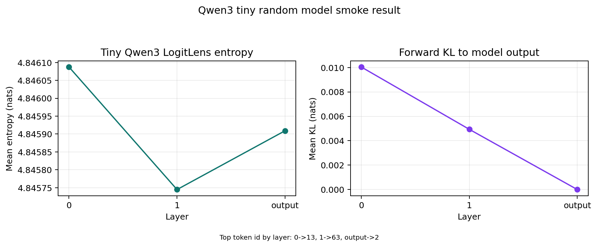

# Qwen Model Support

This note documents the Qwen support contribution for
`AlignmentResearch/tuned-lens`.

## Before

`tuned_lens.model_surgery.get_final_norm()` and
`tuned_lens.model_surgery.get_transformer_layers()` only recognized model families
such as OPT, GPT-NeoX, GPT-2, LLaMA, Mistral, and Gemma. Qwen models reached the
fallback branch and raised:

```text
NotImplementedError: Unknown model type <class 'transformers.models.qwen3.modeling_qwen3.Qwen3Model'>
```

That blocked even LogitLens-style prediction trajectories for Qwen3.

## Changes

- Added conditional Qwen model detection for `Qwen2Model` and `Qwen3Model`.
- Mapped Qwen final normalization to `base_model.norm`.
- Mapped Qwen decoder layers to `base_model.layers`.
- Added tiny random Qwen2 and Qwen3 configs to the existing random model test
  fixture, so model surgery and lens construction are tested without downloading
  large checkpoints.

The Qwen checks are conditional on the installed Transformers version. Older
Transformers versions can still import `tuned_lens`; newer versions that expose
Qwen2/Qwen3 classes get support automatically.

## Smoke Result

The snapshot below was generated from a deterministic tiny random `Qwen3Config`
on CPU. It is not a quality benchmark; it is a proof that the Qwen3 model surgery
path works end to end with `LogitLens` and `PredictionTrajectory`.



| Layer | Top token id | Mean entropy | Mean forward KL |
| --- | ---: | ---: | ---: |
| 0 | 13 | 4.846087 | 0.010041 |
| 1 | 63 | 4.845745 | 0.004934 |
| output | 2 | 4.845909 | 0.000000 |

Validation command:

```bash
python -m pytest tests/test_model_surgery.py tests/test_lenses.py::test_tuned_lens_from_model -q -k qwen
```

Result:

```text
6 passed, 22 deselected
```
