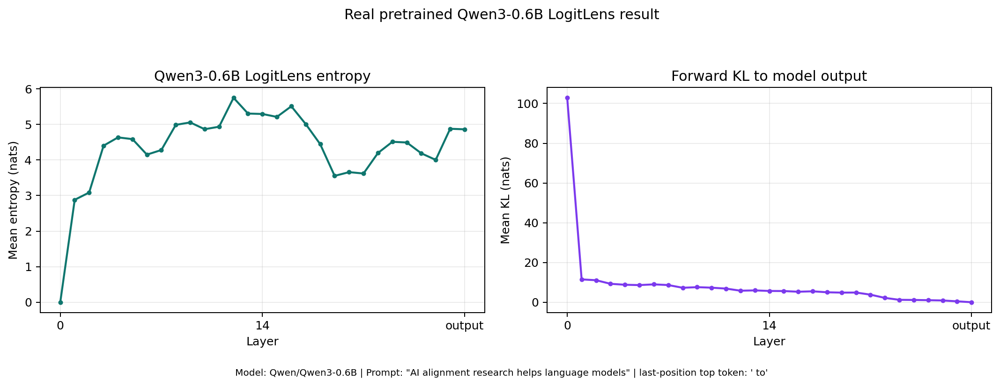

# Qwen Model Support

This note documents my Qwen support contribution for `AlignmentResearch/tuned-lens`.

## Issue

Related issue: [AlignmentResearch/tuned-lens#143](https://github.com/AlignmentResearch/tuned-lens/issues/143)

`tuned_lens.model_surgery.get_final_norm()` and
`tuned_lens.model_surgery.get_transformer_layers()` did not recognize Qwen
decoder models. For Qwen3, this raised:

```text
NotImplementedError: Unknown model type <class 'transformers.models.qwen3.modeling_qwen3.Qwen3Model'>
```

This blocked LogitLens and `PredictionTrajectory` usage with Qwen models.

## What I Changed

- Added Qwen-family decoder model support based on `model_type`, `layers`, and
  `norm`.
- Mapped Qwen final normalization to `base_model.norm`.
- Mapped Qwen decoder layers to `base_model.layers`.
- Added test coverage for Qwen2, Qwen2-MoE, Qwen3, Qwen3-MoE, and Qwen3-Next.
- Ran a real pretrained `Qwen/Qwen3-0.6B` LogitLens check and added the result
  snapshot.



## Where I Changed

- `tuned_lens/model_surgery.py`
- `tests/conftest.py`
- `docs/qwen-support/README.md`
- `docs/qwen-support/qwen3_0_6b_logit_lens_result.png`
